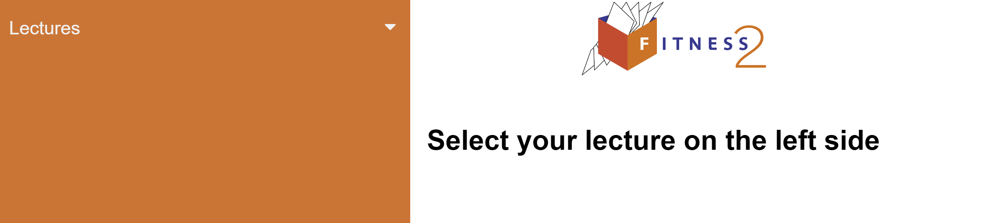
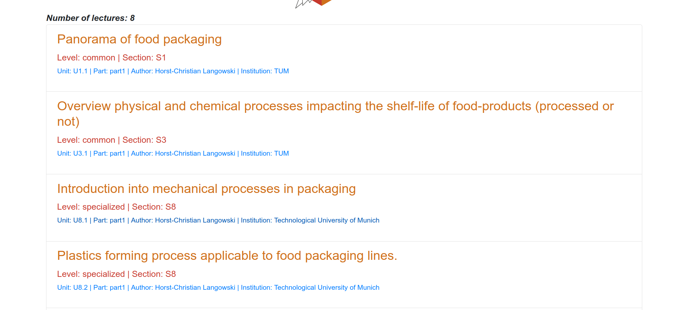
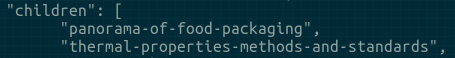

[toc]

# FITNESS 2 project

Follow-up of the original FitNESS project "Food packaging open courseware for higher education and staff of companies"
https://fitness.agroparistech.fr

# Documentation

## Download the interface

<a href="https://github.com/scours/fitness2/tree/wip" target="_blank">Click on this GitHub repository</a>, then click on the `Code` button on the right and on "Download ZIP".

Once you have downloaded the file, unzip it and open the **lectures-archi/sidepanel.html** file. You should see an interface like this one:

You can then select a course by clicking on "Lectures" on the left. This menu allows you to click on a particular lecture and see the details of that lecture. This menu allows you to view courses up to level 3: level 1 -> level 2 -> level 3.

When you click on a course, the details displayed are not final, i.e. the information displayed can be changed.

## How to modify displayed lectures on the interface?

These courses can be modified by anyone using the GitHub collaboration tool. To edit the courses you will need to:

1. Create a <a href="https://github.com/join" target="_blank">GitHub account</a>

   1. You can see the different GitHub accounts types <a href="https://docs.github.com/en/get-started/signing-up-for-github/signing-up-for-a-new-github-account" target="_blank">here</a>.

2. Clone the project (repository)

   1. Go to <a href="https://github.com/scours/fitness2/tree/wip" target="_blank">this page</a> and <a href="https://docs.github.com/en/get-started/quickstart/fork-a-repo" target="_blank">fork</a> the "wip" folder (or branch) of the project

3. Modify displayed lectures:

   1. Once the project is forked, you have a copy of the project. You can make the changes you want. To modify the lectures displayed, you will have to modify the manifests/root.manifest file. All the changes you want to make must be inside the "children" property. The root file is configured as follows: You have the "children" property, then, inside that property, you have the path for each lecture to be displayed. For example `Properties of food packaging materials/Thermal, mechanical and barrier properties/thermal-properties-methods-and-standards` will display the thermal properties methods and standards lectures details. Those details can be found in the "thermal-properties-methods-and-standards" file which is inside the "**Thermal, mechanical and barrier properties**" folder which is inside the "**Properties of food packaging materials**" folder. The root file allows us to define what we want to display on the left side of the interface. The root file is in <a href="https://en.wikipedia.org/wiki/JSON" target="_blank">json</a>, so the content added to this file must follow the json format. Essentially, for this file, it comes down to respecting braces, quotation marks, commas and square brackets. A visual interface to modify the root file can be created if needed. <a href="https://www.w3schools.com/js/js_json_intro.asp" target="_blank">Here</a> you can find more information on the json format.

4. Contribute with your modifications:
   1. Once you have made your modifications, you can contribute and propose your modifications by creating a <a href="https://docs.github.com/en/pull-requests/collaborating-with-pull-requests/proposing-changes-to-your-work-with-pull-requests/creating-a-pull-request" target="_blank">pull request</a>. The pull request is needed to see your modifications on the interface provided, as the interface is working with this <a href="https://github.com/scours/fitness2/blob/wip/manifests/root.manifest" target="_blank">root.manifest</a> file. Once your modifications will be accepted, your modifications will be merged with this <a href="https://github.com/scours/fitness2/blob/wip/manifests/root.manifest" target="_blank">root.manifest</a> file and the interface will be able to reflect and display your modifications.

## How to add/modify a lecture to/of the interface?

**To add a lecture**

1. Add lectures information and save them
   1. Once you are on the interface, as shown in the ["Download the interface"](#download-the-interface) section, you will see the "Manifest editor" link at the bottom of the page. Click on that link and fill the fields. Once you are satisfied, click on the "Save modifications" button at the bottom of the page, then a file containing all your changes will be downloaded, we call that file the manifest file.
2. Upload the manifest file to GitHub
   1. If you have not created a GitHub account or cloned the project yet, you can do that by following the procedure in the ["How to modify displayed lectures on the interface?"](#how-to-modify-displayed-lectures-on-the-interface) section.
   2. Upload the manifest file in the `manifest` folder of your cloned project
      1. Go to GitHub and open your cloned project, then upload the manifest file using <a href="https://docs.github.com/en/repositories/working-with-files/managing-files/adding-a-file-to-a-repository" target="_blank">this procedure</a>
3. Contribute with your modifications
   1. You can contribute with your changes by following the "contribute with your modifications" steps in the ["How to modify displayed lectures on the interface?"](#how-to-modify-displayed-lectures-on-the-interface) section.

**To modify a lecture**

These are almost the same steps as for adding a lecture (above). What changes is step 1 which allows you to fill in the fields: when you want to modify a lecture, you click on "Manifest editor", then on "import a manifest" and then you modify the desired fields. For the rest, the procedure is the same.

## How to add your own lecture in the syllabus on the left (lecture already available on FitNESS 1 platform)?

To open and see the current syllabus, double click on “sidepanel.html”.

You will then be able to select the lecture you want to display.

**How to add your own lecture in the syllabus on the left (lecture already available on FitNESS 1 platform)?**

For that, we will use the metadata file.

On the FitNESS platform, click on “Author’s interface to revise metadata”.

Select your name

Select a lecture

Modify the variables you want. For example Title, Authors, Abstract, Topics, etc. Once you are satisfied with your modifications, click on “Save modifications”. By clicking on that button, you will download a file with the “json” extension.

To display your lecture in the syllabus, you will use a manifest file. A manifest is actually a metadata file. What changes is the extension. So you will change the extension from “json” to “manifest”. You can also give your file a name you will remember, for example, the name of your lecture. Here is an example where we change the file name as well as its extension.

Once you have the new extension file, you can add your file in the “manifests” folder. In the “manifests” folder, you have the “root.manifest” file. The root file is our main file. It will help us define the lectures we want to display inside the syllabus. Open the “root.manifest” file.

Inside that file, you will see the “children” variable. Add your new file into that variable, so it will be displayed in the syllabus. Save the “root.manifest” file.

In your browser, refresh the “sidepanel.html” file. Now, you should see your new lecture in the syllabus on the left.

If you can’t see your new lecture, here is what you can do:

- Close the “sidepanel.html” file and open it again.
- Force refresh the webpage, here is a guide that will help you do that : https://www.filecloud.com/blog/2015/03/tech-tip-how-to-do-hard-refresh-in-browsers/

## How to add your own lecture in the syllabus on the left (lecture not available on FitNESS 1 platform)

To add a course that does not yet exist on the platform, you will follow the same procedure as above and when you get to the [modify variables step](#modify-variables), you will change all the variable values to the values of your new course. After clicking on the "Save modifications" button, the information of your new course will be saved in a file.

For now, you can't change all the variables yet, but in the future you will be able to do so and we will also be able to add new variables if needed.

## FITNESS 2 GitHub repositories

The work on the [FITNESS 2 project is located here](https://github.com/scours/fitness2/tree/wip) (it is a fork).

The initial repository [is located here](https://github.com/ovitrac/fitness2)

## pptx to FITNESS format

Below, you will find the steps to convert a pptx file to html FITNESS format.

1. Get the pptx file
2. Convert the pptx to pdf
   1. For example, open pptx on powerpoint online, and then: file → save as → download as pdf
3. Check that the pptx file does not contain hidden slides. If hidden slides are present, make a copy of the pptx, to keep the original, then delete the hidden slides from the file you are working on (non-original file). **If slides are hidden, the matlab code will not work as expected**
4. Convert pptx to img png (or recover the **png** images folder)
   1. For example: open in Powerpoint and do file -> save as -> download as images **(do not do it online because it gives JPG and not PNG, using JPG, the matlab code does not work). Check that there are no hidden slides in Powerpoint, otherwise when the matlab script is executed, there will not be the right account, so we will have to regenerate the PNGs again, therefore a waste of time.**
   2. Change the file names, they must be of the “Slide*” type, otherwise the matlab file throws an error, since it expects file names of the Slide* type.
5. Put the pdf file and the images folder (png) at the same level as the pptx file (in the “local_computer/Bulk/fitness2022/conversion/source/lectures” folder)
6. Create a new .ods file (in the folder “local_computer/Bulk/fitness2022/conversion/output”) with the name of the pptx file to convert and modify the variables
   1. sourcelocal variable
   2. pptx variable
   3. university variable
   4. level variable
   5. reading variable (When there are spaces in the name, the matlab script does not react well, it produces errors. It is therefore better to only use hyphens)
   6. runningtitle variable (When there are spaces in the name, the matlab script does not react well, it produces errors. It is therefore better to only use hyphens)
   7. authors variable
7. Modify the variables of the matlab file “local_computer/Bulk/fitness2022/conversion/matlab/fileid_general.m”
   1. modify the fileid variable
8. Run the matlab file: click on run (green arrow) or F5

## Update / Add / remove Quiz or Q&A : questions and answers

1. Copy the content of the markdown files with Q&A. That file has been generated by following the [documentation here](https://fitness.agroparistech.fr/fitness2/train-the-trainers/session-2/html-files/quiz-creator-tool.html).
2. Paste the content in “quiz-creator-tool-online/src/markdownContentVars.js” in a variable (for example “bacterialPolyester”, follow the way the other variables have been created in that file)
   1. In the variable, you can also add the “canBeSentByEmail:true” property in the variable to indicate that the result of the Q&A can be sent by email (see how that property has been used in other variables in that file)
3. Save the file
4. In the “manifests/” folder, select the manifest in which you want to add the Q&A, for example “manifests/Innovations/Bacterial polyesters/bacterial-polyesters.manifest”
5. Modify the “qAndAVariables” property to determine which Q&A to show
   1. This property can accept multiple variables from the “quiz-creator-tool-online/src/markdownContentVars.js” file. Each entry of that variable is formatted as: “name to display for the Q&A / name of the variable in “markdownContentVars.js” file. For example "qAndAVariables":["Access Q&A number 1/bacterialPolyester"]
   2. save the file
6. Update prefetch (link to “update prefetch” steps)

## How to update prefetch:

In the file “lectures-archi/sidepanel.js”, to generate the new static content (the prefetch):

1. modify the line “const refreshLecturesPrefetch = false;” to “const refreshLecturesPrefetch = true;”
2. save the file

Then in a web browser:

1. open on a local web server, for example http://127.0.0.1:5502/lectures-archi/sidepanel.html
   1. The web browsers used for this procedure are chrome and firefox.

The static content has been generated and is available in the logs tab

1. Open the “[web developer tools](https://balsamiq.com/support/faqs/browserconsole/)” and head to the “console” tab
2. Then copy the content between: “lecturesPrefetchContent beg” and “lecturesPrefetchContent end”
3. Paste that content in “lectures-archi/lectures-prefetch.js”
4. save the file.

Now that the static content has been generated, we can set “lectures-archi/sidepanel.js” file to its initial state:

1. modify the line “const refreshLecturesPrefetch = true;” to “const refreshLecturesPrefetch = false;”
2. save the file.

Push the modifications to github

Log on server

Retrieve the latest modifications from github:

cd server/Bulk/fitnessII/fitness-github-repo

./update-content-on-server.sh

Modifications can now be seen on https://fitness.agroparistech.fr/fitness2/lectures/sidepanel.html

## All FITNESS presentations

all the presentations created for FITNESS [are listed here](https://fitness.agroparistech.fr/fitness2/lectures/fitness2-presentations.html)

## Media files on server

The following folder on the server contains some media files.

Those media files are stored there instead of GitHub, because generally we tend to keep on version control systems only text based files.

server/Bulk/fitnessII/www/wip/media

You can view the content through the internet:

https://fitness.agroparistech.fr/fitness2/wip/media/

## Excalidraw content

Excalidraw generated contents are [shared in this folder](https://drive.google.com/drive/folders/18BZcX62LPk3CCkAGVDYCHGlOlZFbYA8z?usp=drive_link).

## how to create a syllabus (standalone) on another web page.

We will create a “ppwr2” syllabus so you can follow the same steps to create your own.

1. Create new web page “ppwr2.html” (you can copy lectures-archi/sidepanel.html)
   1. In ppwr2.html, point to ppwr2.js, instead of “sidepanel.js”
2. Create new .js file “ppwr2.js” (you can copy lectures-archi/sidepanel.js)
   1. In “ppwr2.js, point to “ppwr2-manifests”, instead of “manifests”
3. Create new manifests folder “ppwr2-manifests” (you can copy the content of “manifests”)
   1. keep only necessary files to create your syllabus. Or follow files and folders structure to create your own. Update root.manifest accordingly.
4. Create new manifest file “ppwr2-prefetch.js” (you can copy “lectures-archi/lectures-prefetch.js”)
5. Update prefetch for ppwr2, in “ppwr2.js”, set variable to true “const refreshLecturesPrefetch = true;”
6. Open ppwr2.html in web browser, open developer console. Copy the content between “lecturesPrefetchContent beg” and “lecturesPrefetchContent end” and put it in “ppwr2-prefetch.js”
7. in “ppwr2.js”, set variable to false “const refreshLecturesPrefetch = false;”
8. in “ppwr2.html”, point to “ppwr2-prefetch.js” instead of “lectures-prefetch.js”
9. Open ppwr2.html in web browser, you should now see your new syllabus

> Co-funded by the ERASMUS+ projects (Cooperation Partnerships for higher education)
> [2017-1-FR01-KA202-037441](https://erasmus-plus.ec.europa.eu/projects/eplus-project-details#project/2017-1-FR01-KA202-037441) > [2022-FR01-KA220-HED-000023509](http://www2.agroparistech.fr/FITNESS2.html)
>
> Work in progress, come back regularly. For our road-map, read [this](https://fitness.agroparistech.fr/fitness2/presentations/FITNess20220208_vitrac.pdf)

**Contributors**

Steward OUADI, AgroParisTech

Olivier VITRAC, INRAE
