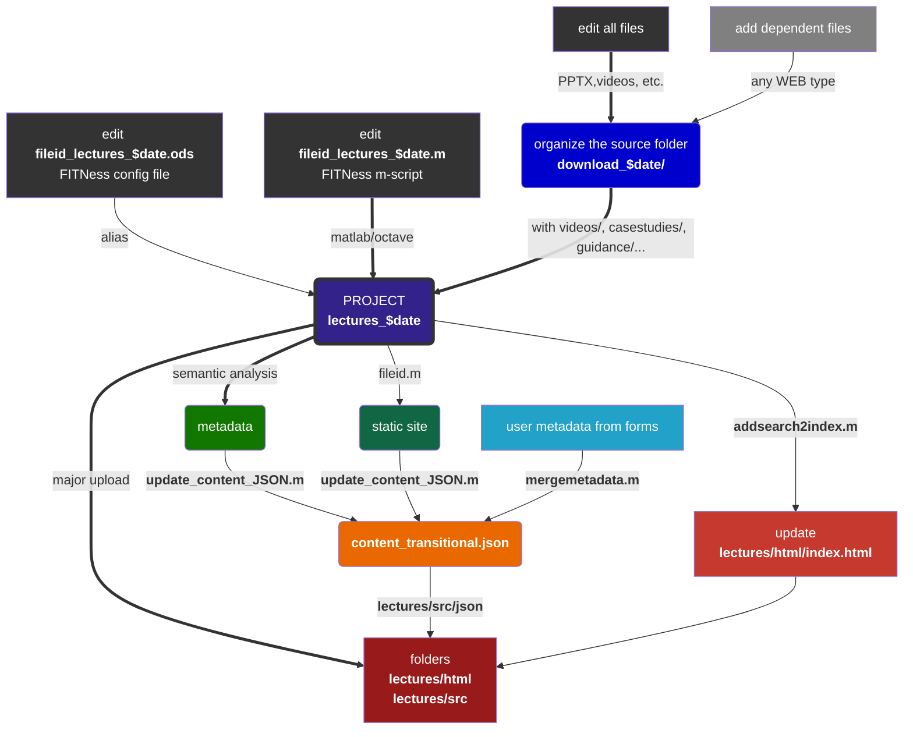

|  |                   <kbd>version 2️⃣02️⃣0</kbd>                    |
| :----------------------------------------------------------- | :----------------------------------------------------------: |
| *Food packaging open courseware for higher education and staff of companies*<br />https://fitness.agroparistech.fr | 🇪🇺 <small>ERASMUS+  Programme<br /><a href="https://ec.europa.eu/programmes/erasmus-plus/projects/eplus-project-details/#project/2017-1-FR01-KA202-037441" title="Project on the European Commission website" target="_blank"><i>contract 2017-1-FR01-KA202-037441</i></a></small> |

# FITNESS PLATFORM

INRAE\\<a href="mailto:olivier.vitrac@agroparistech.fr">Olivier Vitrac</a> - December 2020

[TOC]


## 1. CONTEXT & OUR AMBITION|🌱

Because the lifetime of food packaging materials is short (less than 6 months), they represent the majority of ♳ plastic wastes. Their 🏭 production, 🚮 collection and ♻️ recycling is also impacting the 🌱environment. They are, however, essential to the 🧃preservation of food, ⛑️food safety and 🥡 food convenience. We are engaged in a ⏲️transitional period imposed by coercive ⚖️ laws : 🚫Single Use Plastics Directive (EU) 2019/904/EC, ⛔ French anti-waste law... None of the proposed lecture contains the 🔢 solution, but the 🔌🌐🎓 platform **FITNess** provides the only 💡 sensible answer to this 🚩complex issue.

> It is necessary to educate oneself, to complete one's education on these complex issues and to mobilize scattered and interdisciplinary knowledge. 


All food packaging and food contact materials are considered ♳♴♵♶♷♸♹🥫🧃🥤🍵🍺&#9749;🍯🍼🥗🍱🍫🥡🍬🍭🍽️🥢🍳🍜 as well as the supply chain ⛓️📦🚚🛒🏬🏭🥦🌾🐟🐄🐖🐔. Production, distribution, design, convenience, environmental impacts, risks, costs, legal constraints are detailed 💰🛢️⚖️🚮♻️🍂🌍⛰️🌊🌈🌥️☠️.


## 2. OUR GOALS & APPROACH| 📚📖💻🎓

> FITNess stands for "*Food packaging open courseware for higher education and staff of companies*". It is a part of an ERASMUS+ Programme funded by the EU Commission (contract 2017-1-FR01-KA202-037441). The starting point of the project is that the challenges posed by food packaging (waste, food and packaging safety, food waste, food prices) need to be addressed through better education of future and current professionals.

The concept of **FITNess version 1️⃣** (this version, https://fitness.agroparistech.fr/) is based on three pillars:

- [ ] **A  &#9989; validated content** (quality, rigor, and openness) covering all essential aspects of food packaging for two levels (novice and advanced);
- [ ] An 🔓 **open-source distribution format**, which can be read on any terminal and even as a PowerPoint replacement product for teaching classrooms. All interactive and non-interactive WEB documents are supported and can be run with or without a server.
- [ ] A 🔍**search engine** adapted to blended-learning education.

The organization in two levels <kbd>common</kbd> | <kbd>specialized</kbd> is arbitrary and do not represent necessarily an indication on the level of difficulty. They notify whether recent scientific results are used or not. <kbd>Common</kbd> contents do not require any specific technical or scientific background. <kbd>Specialized</kbd> content are specific and therefore more <kbd>advanced</kbd>. The different sections and units are less connected together. They can be read in arbitrary order based on your interests and needs. Our intent was not to be <u>exhaustive</u>, but to propose sufficient materials to resolve real problems associated to food packaging: design, compliance, risk and impact assessment... Though the content was prepared by experts in the field, the content cannot be considered authoritative and cannot replace the scientific literature or reference text books.

> The content is provided "AS IS". We are diligent to improve the quality of the content and of the experience.  


## 3. FITNESS PLATFORM AT A GLANCE | 👁️

### 3.1 Everything in 54'' | ⏱

<video width="100%" controls="controls" poster="./videos/conv4web_fitness_overview.jpg" preload="auto">
    <source type="video/webm" src="./videos/conv4web_fitness_overview.webm">
    <source type="video/mp4" src="./videos/conv4web_fitness_overview.mp4">
</video>

👷<small>The video was recorded with an oldest version of the platform FITNess (version 2️⃣01️⃣9). 🎁 Check below the new content and features of FITNess 🎂2️⃣02️⃣0.</small>

### 3.2 Welcome screen | 😊

FITNess works within your web-browser online or offline: no installation, no password, no tracking.

<br /><br />

>  👍 The platform is organized as an <kbd>APP</kbd>, you can reach all the proposed content from one single page. 💡 The platform integrates its own search engine, but you can ask <kbd>Google</kbd> what it knows from any topic using the platform FITNess.
>
> - [ ] <small>Example 1: https://www.google.com/search?q=diffusion&sitesearch=fitness.agroparistech.fr (search the word **diffusion**)</small>
> - [ ] <small>Example 2: https://www.google.com/search?q=bottle+site%A3fitness.agroparistech.fr&tbm=isch (search the image of a **bottle**)</small>
>
> Take the benefit of the permissive license of FITNess content.

### 3.3 It works with all screens | 📲
The interface is intuitive and accessible at the tips of your fingers. **Learn whenever 🕗🕓📅 and wherever 🏡🏖️🌴🏢🏫 you want**.

<br /><br />

> 👍 We recommend the users to select a terminal, which is adapted to your eyes and fingers.

### 3.4 An adaptive interface | 🏫🏭&#127963;&#65039;

The interface is intuitive and adapts to the needs and context whether you are a 👩‍🎓👨‍🎓 student/learner who is being followed by a 👩‍🏫👨🏽‍🏫 teacher/trainer, an 🧍🧍‍♀️🧍‍♂️🤰 autodictate, a 👷👨‍🔧👨‍🔬👨‍🍳👨‍🌾👨‍💼 professional updating his knowledge, or a teacher needs a software to deliver his course in a 🏫 classroom or a 🏡📡distance learning environment.

<br />

<br />

> 👍 We encourage curiosity, do not hesitate to click on related documents and activities.

### 3.5 Hundreds contents for self- or directed- training | 🗓️💯

The content of FITNess is varied and sufficiently developed to offer 2️⃣to 3️⃣📆 months of online training. It is not constructed in a linear sequence and can be followed in an order adapted to each individual's level and needs. The main index &#128451;&#65039; provides a reading guide built on the basis of progressive 🎚️ level and complexity. 

<br />

<br />

> 👍 Though we offer a wealth of presentations and videos, we invite trainees and students to take time to read more detailed documents and to follow step-by-step the proposed case-studies.

### 3.6 Find relations on each page | 🧭🕸️

⛓️🔗 Relations can appear as as linked 📄 documents and ⛳🎣 activities or as 📖 related lectures. Topics offer a free alternative to 🧭discover new contents and lectures.

<br />

<br />

> 👍 In presentation mode, press <kbd>?</kbd> to list ⌨️ shortcuts. Keys <kbd>ESC</kbd> or <kbd>O</kbd> gives you access to access to the slide sorter. Note the ⏯️ button to launch the slideshow automatically. The horizontal bar enables to jump to any slide (⏮️⏭️). Arrows ↔️️️ ️(content direction) ↕️ (links) appear automatically to adapt to the content.


## 4. HOW IT WORKS | &#8505;🧙‍♂️

### 4.1 Workflow automation | ⚙️🐾

Most of the content has been prepared using PowerPoint and converted into HTML5, CSS and JavaScript codes. One practical consequences is that the content can be hosted on a Web Server (accessible from everywhere without authentication and installation), read on any smart phone/tablet/PC and combined with all existing Web Technologies (interactive content, indexing, cloning). Currently, ~3,000 slides are searchable, printable, and accessible as a single document for both the learner/student and the teacher. This static content is combined with case-studies and many supplementary materials. A **dual interface** enables the teacher/professor to use also a browser for class teaching. 


The vectorial content is preserved to offer the same quality (or even superior) within a web-browser. The search engine written in JavaScript (`jsonsearch2de()`) reuses a database (1.2 MB) built during conversion stage using semantic analysis and statistical analysis. The 🕵search occurs in real-time (by typing three letters) directly in the webpage. Additional *metadata* added by the teacher enable to connect all lectures and contents regardless their location in the structure.

> ***Example of the generation of FITNess 2020 (version Dec 21, 2020).*** The core of FITNess (version 2020) was built from 115 <kbd>PPTx</kbd> documents (>300 slides, obeying to ), which were converted and indexed in about 10-15 mins using three main core programs (open-source, located in the directory make/): `pptx2reveal()`, `extractTXTfromPPT()` and `update_content_JSON()`. Scripts (last one: `fileid_20201123_20201221`, `addsearch2index`) finalize the assembly of all generated files and attach all related documents (videos, animations, Q&A, case-studies, guidelines). 

The following features have been explicitly considered:

- One **single tool** for teacher (presenter view) and learner (web)
- **No installation** required (pure Web, responsive *HTML5*, supports all screens, touch-screen interface)
- Each slide, page, document has its **own URL** (*e.g.*, steps to authorize a new substance is shown in <kbd>Level specialized</kbd>/<kbd>Section S3</kbd>/<kbd>Unit U3.1</kbd>/<kbd>part1</kbd>#/<kbd>Slide 7</kbd>, which reads in shorts: [specialized/S3/U3.1/part1.html#/7](https://fitness.agroparistech.fr/fitness/lectures/html/specialized/S3/U3.1/part1.html#/7)
- The platform supports **online** (no registration, no tracking) and **offline** (from 2 to 9 GB) working modes.
- **Open-source** code, content with permissive licenses
- Slides and text can be **edited** in *Markdown*
- **Blended learning**: mixed content, interactive content
- *Google*-like Search Engine
- All documents can be **printed** (as *Wikipedia*)
- Online supports are **indexed** by *Google*
- Everything is **cloneable**

> ***Server conversion vs. standalone one***. Streamline conversion is agile, efficient and independent of commercial software. It enabled trainers/teachers to be focused on the creation of original contents.  Full traceability is maintained at each stage by embedding metadata on each page/slide and page (source file, version, list of converted objects, text searchable by Google). The content and the structure can be refreshed as many times as required. The workflow combines *prefetch files* and *fingerprints* (hash keys) to determine, which files and branches need to be updated.

### 4.2 Why Markdown? | 📑

Markdown is becoming rapidly a standard on the web. It enables rich-text by using a lightweight markup syntax. Plan-text and Markdown editors can be used to update or to edit the content (to add links, videos, JavaScript code, flowcharts and diagrams written in [Mermaid](https://mermaid-js.github.io/mermaid/), etc.) [Typora](https://typora.io/) was chosen as recommended Markdown editor as it free and available across all platforms (OS X, Linux, Windows). 


### 4.3 Metadata | 🔎🔖

Metadata are essential to offer an experience of blended learning: you start where, when and how you wish. Their nature is diverse. Firstly, they provide an automatic and human description of each material. They contain also structural and administrative information, such as the type of license, the name, the revision history and the list of authors of the original document.


Metadata are organized in a very large database (JSON format), which can be read by a browser and added to the content of a web page. This information is used to offer new capabilities: such as extracting all documents related together or containing a specific keyword. The depicted example (below) is showing how the equation of Piringer can be retrieved and visualized from the multiple content of FITNess.


Ninety percent of metadata are extracted automatically from documents (PPTx, PDF...).  Specific contents such as abstracts, topics, recommended readings require the contribution of the teacher/professor. A specific interface is proposed to revise the default values of metadata. A robot merge the different versions to smooth conflicts and reach a consistent database.


## 5. HOW TO USE IT | 👥

### 5.1 Browsing | 🕵️‍♀️🕵️‍♂️

The main content of FITNess is proposed as a single index corresponding to a suggestion of a full curriculum. Alternatively, a lecture can be found by entering keywords and/or following suggested topics. The content of FITNess is vast and interdisciplinary. The contributors think that the structured and specific approaches of learning are both valuable. As a rule of thumb, starts by the table of content when you need to learn progressively and type in the search area as soon as you are looking for something more specific. Clicking on search by keywords activates a full search on all slides.


### 5.2 Learning | 👩‍🎓👨‍🎓

Most of the lectures are provided as a slideshow very similar to PowerPoint. The main difference is that the progression (backward and forward) can be done horizontally (as in PowerPoint: main slides) and vertically. Vertical slides are slides generated automatically to offer a table of content and connections with previous and next lectures. Press <kbd>?</kbd> to list all available options. For example, <kbd>O</kbd> is used to activate the overview (slide sorter in PowerPoint).


### 5.3 Teaching and learning | 👩‍🏫👨‍🏫

Each presentation includes a presenter mode (<kbd>P</kbd>) enabling a display on dual screens or screen+beamer. The presenter mode is showing the notes, the elapsed time, the next slide... The layout can be changed. Pressing <kbd>Ctrl</kbd>+<kbd>P</kbd> prints the entire document or a specific slide.


## 6. HOW TO CLONE FITNESS OR TO RUN IT OFFLINE | 📴

### 6.1 Download procedure | ⬇️

The FITNess platform combines computer code (client and server sides, on-line and off-lines), teaching (HTML, Markdown, SVG, PNG) material and activities (Q&A, case-studies, guidelines, videos...). The 🗄️ entire content of FITNess (with sources) is released as 🗜️ ZIP packages with (~23 GB). Click here to ⬇️ [**download the zip file**](https://agroparistechfr-my.sharepoint.com/:u:/g/personal/ouadi_agroparistech_fr/EZsFUzrWudZLlJq1nNilzFQBlOprA91NLGhDO-kf4k24iQ?e=QDY5VT).

<br /><br />

> Original PowerPoint files are not provided as it was decided to distribute only 🌐 WEB compliant files. All slides are available as JPG (raster images) and SVG (vectorial images) in the 📂 folders `lectures/html/common(or specialized)/S*/U*/src_part1/, src_part2/...` corresponding to the considered part. The text is available in the original MarkDown files next to the 📄 original files `part1.html, part2.html....`

### 6.2 Running off-line | 💤

You do not need any &#128423; webserver to 🛫 launch the FITNess platform content. You just need to ⬇️ download everything (see **§6.1**), open the 📂 folder `lectures/` and start the application by clicking on the 📄 file `index.html`. No installation is needed and it runs on Windows, Linux, Mac with a modern &#128468; Web browser. Eligible browsers must use the render engine WebKit or Chromium such as: Google Chrome, FireFox, Safari, Microsoft Edge based on Chromium... Internet Explorer is not supported.

> We use a🏳️🏴 dual technology enabling FITNess to run within a webserver (Apache for us on Ubuntu 18.04 for development and CentOS 8 for production) or without. **All URLs are indeed relative and not absolute, asynchronous connections to the server are replaced by a faked server when the system goes offline** 💤. 

### 6.3 Running online | 🤳

The platform FITNess has been designed to be easily duplicated as needed from a 🗜️ ZIP package. The 📐flexible architecture enables to ⚓anchor the server to any 🗁 place of an existing &#128423; webserver (with several GB of free space). There is no special security configuration required as 🚫 no information is sent back to the server. All 🕀 interactions run on the client side with ✔️ proper JavaScript codes included in each 📦 package.

> FITNess runs on https://fitness.agroparistech.fr within a VirtualHost directory `conf.d/` in Apache. We use a customized version of &#128479; fancy-index to render &#128486;nicely&#128487; the content of each folder with a uniform &#128445; layout between all &#128464; pages of FITNess. 
>
> ```sh
> #Fitness configuratop, (partial description due to security reason)
> # $ INRA\Olivier Vitrac - rev. 2020/12/30 $
> Alias /fitness/ "/##############/fitness2020/www/"
> <Directory "/##############/fitness2020/www/">
> 	# index options (we keep visible only files associated to lectures)
> 	Options FollowSymlinks Indexes MultiViews
> 	IndexOptions Charset=UTF-8 +FoldersFirst +IgnoreCase +ScanHTMLTitles
> 	IndexOptions IgnoreCase FancyIndexing HTMLTable SuppressHTMLPreamble FoldersFirst VersionSort NameWidth=* DescriptionWidth=* XHTML
> 	IndexOptions IconHeight=32 IconWidth=32
> 	IndexIgnoreReset ON
> 	IndexIgnore .ftpquota .DS_Store .git *.ico *~ *# *.asv *.bak *.sav *.json *.js 
> 	[.... removed lines]
> 	IndexOrderDefault Ascending Name
> 	# style (we apply a very similar style to all pages of FITNess including index)
> 	IndexStyleSheet /fitness/fancy-index/style.css
> 	HeaderName /fitness/fancy-index/header.html
> 	ReadmeName /fitness/fancy-index/footer.html
> 	# Fitness descriptions (a description is added to all files)
> 	AddDescription "internal lectures of AgroParisTech" */AgroParisTech
> 	AddDescription "Lectures not included in Fitness" */external
> 	AddDescription "Safe Food Packaging Portal version 3" SFPP3 sfpp3
> 	[.... removed lines]
> 	AddDescription "interactive content in HTML" .html
> 	AddDescription "Markdown source file (see HTML version)" .md .MD
> 	[.... removed lines]
> 	AddDescription "assets" */src
> 	AddDescription "Fitness source code" */make
> 	AddDescription "<b>MAIN LECTURE FOLDER</b>" */lectures
> 	AddDescription "<b>Lecture content in HTML</b>" */html
> 	# icons (all icons are shown in SVG)
> 	[.... removed lines]
> 	# authorizations
> 	AllowOverride none	
> 	Require all granted
> </Directory>
> ```
>
> 🆘<small>Send an 📧 e-mail to [Olivier Vitrac](mailto:olivier.vitrac@agroparistech.fr) if you need assistance during duplication.</small>


## 7. HOW TO REVISE OR ADD CONTENT| 🙋🏻‍♀️🎗️✏️

### 7.1 License 🔓©🖼

The 🖼️ content of FITNess is 🆓 and released on permissive licenses ([Creative Commons version 4.0]([Creative Commons license - Wikipedia](https://en.wikipedia.org/wiki/Creative_Commons_license#Four_rights)): <kbd>CC</kbd>). The content of FITNess is publicly © copyrighted (free distribution). 

>  The © rights associated to the content of FITNess depends on the document and on the author. Please, check all the time the license associated to it. In case of doubts ,contact the author or the administrator of the platform.
>
>  In absence of license <kbd>CC</kbd> <kbd>**BY**</kbd>-**<kbd>NC</kbd>**-<kbd>**SA**</kbd> holds (Attribution, Non-Commercial, Share-alike). For some works, the previous license is replaced by a more restrictive one: <kbd>CC</kbd> <kbd>**BY**</kbd>-**<kbd>ND</kbd>**-<kbd>**SA**</kbd> holds (Attribution, Non-Derivative, Share-alike).
>
>  > > **Meaning of clauses** <kbd>CC</kbd> 4.0 | *Remember that our work is non-commercial and educational.*
>  >
>  > - [ ] <kbd>**BY**</kbd> Credit must be given to the author and the affiliated institution. **We add that you have to acknowledge that the content and the tools have been partly funded by the European Commission under the contract  [2017-1-FR01-KA202-037441](https://ec.europa.eu/programmes/erasmus-plus/projects/eplus-project-details/#project/2017-1-FR01-KA202-037441).**
>  > - [ ] <kbd>**NC**</kbd> You copy, distribute, display, and perform the work and make derivative works and remixes based on it only for [non-commercial](https://en.wikipedia.org/wiki/Non-commercial) purposes.
>  > - [ ] <kbd>**ND**</kbd> You copy, distribute, display and perform only verbatim copies of the work, not [derivative works](https://en.wikipedia.org/wiki/Derivative_work) and [remixes](https://en.wikipedia.org/wiki/Remix_culture) based on it. Since version 4.0, derivative works are allowed but must not be shared.
>  > - [ ] <kbd>**SA**</kbd> You may distribute derivative works only under a license identical ("*not more restrictive*") to the license that governs the original work.

### 7.2 Minor revisions and derivative works | 🛩️

Minor revisions and derivations are easily to perform as the entire platform and content relies on web technologies. All files are TEXT files or IMAGES or VIDEOS and interpreted by your browser, not by the server. All documents can be edited and updated on the platform (nothing is hidden,  <kbd>CTRL</kbd>+<kbd>U</kbd> on any page will show you the code). 

> HTML 5 documents with complex interactions are not easy to modify. You need a good text editor, such as [Visual Studio Code](https://code.visualstudio.com/), it is free and available on all systems. For presentations and text works, we recommend an alternative is to modify the native <kbd>Markdown</kbd> document, which has been used to generate the corresponding HTML 5. Standard  <kbd>Markdown</kbd> documents are used for text (usually written with [Typora](https://typora.io/), free while in beta version). A [flavored <kbd>Markdown</kbd>](https://github.com/webpro/reveal-md) is used to create animated presentations using the [the HTML presentation framework | reveal.js](https://revealjs.com/).
>
> > Example: To modify the presentation [common>S4>U4.3>part1](https://fitness.agroparistech.fr/fitness/lectures/html/common/S4/U4.3/part1.html#/) on "Smart Packaging", replaces in the URL the extension <kbd>.html</kbd> by <kbd>.md</kbd>:
> >
> > - [ ] https://fitness.agroparistech.fr/fitness/lectures/html/common/S4/U4.3/part1.html
> > - [ ] by https://fitness.agroparistech.fr/fitness/lectures/html/common/S4/U4.3/part1.md
> >
> > > The content reads easily. Slides are added vertically (<!--v-->) or horizontally (<!--s-->).
> > >
> > > ```markdown
> > > ---
> > > title: 'common>S4>U4.3>part1'
> > > separator: <!--s-->
> > > verticalSeparator: <!--v-->
> > > theme: moon
> > > revealOptions:
> > >     transition: 'convex'
> > >     backgroundTransition: 'fade'
> > >     viewDistance: 5
> > >     center: false
> > > [.... removed lines]
> > >     maxScale: 3
> > >     display: 'block'
> > >     transitionSpeed: 'default'
> > > ---
> > > ___
> > > ## Smart packaging - INNOVATIONS IN FOOD PACKAGING
> > > ### Maria Jose Fabra
> > > ___
> > >     version: production (0.331)
> > >     date: December 29, 2020
> > >     content: 37 slides
> > >     class: common>S4>U4.3>part1
> > >     title: Smart packaging - INNOVATIONS IN FOOD PACKAGING
> > >     source: CO_4_3_ BA_IN_Va_CSIC.pptx
> > >     hash: 92d9d09a92855d8b57090b47c1bbbae7
> > >     contact: olivier.vitrac@agroparistech.fr
> > > ~~~~[REMOVED LINES]~~~~
> > > 
> > > <!--v-->---
> > > # CONTENT
> > > ---
> > > *  [1/37] [Slide 01/37](#/1)
> > > *  [2/37] [Unit 4.3](#/2)
> > > *  [3/37] [Slide 03/37](#/3)
> > > *  [4/37] [Smart](#/4)
> > > *  [5/37] [Applications](#/5)
> > > *  [6/37] [Measuring the condition of the package on the outside](#/6)
> > > *  [7/37] [Indicators](#/7)
> > > *  [8/37] [Substances that indicate the presence or absence of another substance or the degree of reaction between two or more substances [...]](#/8)
> > > *  [9/37] [Time-temperature indicator (tti)](#/9)
> > > *  [10/37] [Time-temperature indicator](#/10)
> > > *  [11/37] [Time-temperature indicator](#/11)
> > > *  [12/37] [Time-temperature indicator](#/12)
> > > ---
> > > #### [go back to the main menu (all lectures)](./../../../../../lectures/html/index.html)
> > > ---
> > > <!--v-->---
> > > ~~~~[REMOVED LINES]~~~~
> > > # slide 03/37
> > >  
> > > note: 
> > > ~~~~[REMOVED LINES]~~~~
> > > 
> > > content provided AS IS - [report a problem](mailto:olivier.vitrac@agroparistech.fr)
> > > <!--s-->
> > > # Smart
> > >  
> > > note: ### A packaging system that is capable of carrying out intelligent functions like - Detecting Sensing
> > > Recording
> > > Tracing
> > > Communicating
> > > Applying scientific logic
> > > 
> > > ~~~~[REMOVED LINES]~~~~
> > > 
> > > 
> > > content provided AS IS - [report a problem](mailto:olivier.vitrac@agroparistech.fr)
> > > <!--s-->
> > > 
> > > ```
> >
> > 🆘The file above has been generated automatically with `ppt2reveal_v2`, but it can edited and 📧 send back to [Olivier Vitrac](mailto:olivier.vitrac@agroparistech.fr). The conversion to HTML 5 is performed command line (syntax in Bash, assuming `node.js` 10.x or later installed, as well as `reveal-md`, current version 4.3):
> >
> > ```bash
> > reveal-md $markdonwfile --static $staticpage
> > ```
> >
> > For Typora files, choose File&rarr;Export&rarr;Html.
>
> ⚠️The platform does not accept direct upload to the server. You need an account with valid credentials to change the content on the platform. On your personal duplicate of the platform, you do not suffer similar constraints.

### 7.3 Major updates | ✈️

It is not recommended to apply large modifications (insertions, replacements, new structures) using the previous methodology. 🖇️**Dependencies** and 👣 **metadata** will not be properly managed. The ⚙️ process to generate automatically the entire platform is quite complex. The ⛓️ workflow used to generate the version of **December 21^st^, 2020** is shown as an illustration. ⏳The final result has the size of 9.8 GB (excluding all prefetch files) and is completed in a couple of minutes  on a fast computer (16 cores, SSD). Videos require usually reencoding to be watched embedded  within a web page.



> The presented nomenclature followed the one used internally.
>
> >  &#8505;&#65039; Similar information is included on the platform as README.html, README.pdf and README.md file.
> > - https://fitness.agroparistech.fr/fitness/README.html
> > - https://fitness.agroparistech.fr/fitness/README.pdf
> > - https://fitness.agroparistech.fr/fitness/README.md
>
> > 🎨 The conversion from &#128461; PPTx to &#128442; HTML5  uses an intermediate conversion in &#128464; PDF (and &#128443; PNG files for legacy with the initial behavior). The conversion to PDF is automatic via `libreoffice --headless --convert-to pdf PPTxfile.pptx`and the subsequent conversion to PNG via `convert -density 300x300 PPTxfile.pdf Slide%d.png` are acceptable options. However, it is recommended to use the export (saveas) features of Microsoft Office 2019/365 to preserve 100% of the appearance of the slides (ex. transparencies, fonts, etc.). All slides were exported with a 300dpi resolution (see [How to change the export resolution of a PowerPoint slide](https://docs.microsoft.com/en-us/office/troubleshoot/powerpoint/change-export-slide-resolution)).
>
> > 🎟 Simple examples to convert a single &#128461; PPTx are shown in the 📂 `make/` folder. Two files are needed:
> >
> > - an ODS file, for example:   [fileid_design_yoghurt.ods](https://fitness.agroparistech.fr/fitness/make/fileid_design_yoghurt.ods) | example from the yogurt case-study
> > - a m-file to run the conversion: [fileid_design_yoghurt.m](https://fitness.agroparistech.fr/fitness/make/matlab/fileid_design_yoghurt.m)
> >
> > > The typical script is short and fully object-oriented.
> > >
> > > ```octave
> > > %% Load aliases from fileid
> > > usr = alias; % alias is a special class/language developed for the project FITNess
> > > usr.set({ 'local','current','fileid'},...
> > >         {'/home/@username/Bulk/fitness2020/downloadWP3/outputs/',...
> > >          'fileid_design_yoghurt.ods',...
> > >         '$local/$current'},'path'); 
> > > def = alias; def.load(usr.fileid)
> > > forcedupdate = true; % <--- set it to true ONLY to update PREFETCH files
> > > favicon = '~/Bulk/fitness2020/template/favicon/favicon.ico';
> > > vsn = 0.27; rev = '$2020/12/24$';
> > > if ~exist(def.wwwroot,'dir'), mkdir(def.wwwroot); end
> > > 
> > > %% do the conversion (set TOC: table of content if needed)
> > > if forcedupdate, pptx2reveal_v2(def.struct,'static','repair','forcedupdate')
> > > else, pptx2reveal_v2(def.struct,TOC,'static','repair'), end
> > > 
> > > ```
> > 
> >💡*Read the next section for  details.* | 🚨 *The codes run with several dependencies (to other opensource projects). The main code has been designed in ⚙️Matlab, but it may run in ⚙️Octave with little modifications.* | 🥼*The code is fully compatible with our simulation framework, developed at INRAE/AgroParisTech/LNE for for the safety of food contact materials.*  

### 7.4 Main developed tools (server-side) | 🧰

Several significant tools (server-side) have been developed to automate the conversion of files, the creation of metadata and the generation of the entire website and to maintain 🧷versioning and traceability of all actions. All developments have be made with Linux Ubuntu LTS 18.04 in mind, they may work on other distributions, Windows and MacOS with little modifications.

> 🖿 The main developed tools (which have been made public) are located in the 📂 `make/` folder: [https://fitness.agroparistech.fr/fitness/make/](https://fitness.agroparistech.fr/fitness/make/)
>
> > 🛠️All the tools in this folder are released under the [GNU General Public License v3.0](https://www.gnu.org/licenses/gpl-3.0.en.html). ==*We attract your attention on article 15 and on the absence of Warranty of any kind.*==
> >
> > > ⚖️**15. Disclaimer of Warranty**
> > >
> > > THERE IS NO WARRANTY FOR THE PROGRAM, TO THE EXTENT PERMITTED BY APPLICABLE LAW. EXCEPT WHEN OTHERWISE STATED IN WRITING THE COPYRIGHT HOLDERS AND/OR OTHER PARTIES PROVIDE THE PROGRAM “AS IS” WITHOUT WARRANTY OF ANY KIND, EITHER EXPRESSED OR IMPLIED, INCLUDING, BUT NOT LIMITED TO, THE IMPLIED WARRANTIES OF MERCHANTABILITY AND FITNESS FOR A PARTICULAR PURPOSE. THE ENTIRE RISK AS TO THE QUALITY AND PERFORMANCE OF THE PROGRAM IS WITH YOU. SHOULD THE PROGRAM PROVE DEFECTIVE, YOU ASSUME THE COST OF ALL NECESSARY SERVICING, REPAIR OR CORRECTION.
> > >
> >
> > ⚡==Please use these tools with care, they are moving/deleting, writing, modifying files and folders==. The use of relative paths instead of absolute paths require a careful definition of server fitness via its `fileid_###.ods` file. The language <kbd>alias()</kbd> has bee developed to avoid mistakes. The syntax is close to Bash, but with object methods and capabilities mimicking the features of PowerShell of Microsoft. It is used now in our group to manage simulation scripts in our researches.

| 🔧🔨Tools (main)                                               | 🗒️ Short description                                          | 🔗 Main dependencies                                          |
| ------------------------------------------------------------ | ------------------------------------------------------------ | ------------------------------------------------------------ |
| [fileid_20201123_20201221.ods](https://fitness.agroparistech.fr/fitness/make/fileid_20201123_20201221.ods) | &#128451;&#65039; last full website definition               | [alias.m](https://fitness.agroparistech.fr/fitness/make/matlab/alias.m) |
| [fileid_20201123_20201221.m](https://fitness.agroparistech.fr/fitness/make/matlab/fileid_20201123_20201221.m) | &#128451;&#65039; last website script engine                 | [extractTXTfromPPT.m](https://fitness.agroparistech.fr/fitness/make/matlab/extractTXTfromPPT.m)<br />[pptx2reveal_v2.m](https://fitness.agroparistech.fr/fitness/make/matlab/pptx2reveal_v2.m) |
| [alias.m](https://fitness.agroparistech.fr/fitness/make/matlab/alias.m) | &#128488; scripting language (full class) to generate the entire website | none                                                         |
| [update_content_JSON.m](https://fitness.agroparistech.fr/fitness/make/matlab/update_content_JSON.m) | &#128373; script  to manage and update all metadata (fully automatic) | [alias.m](https://fitness.agroparistech.fr/fitness/make/matlab/alias.m) |
| [mergemetadata.m](https://fitness.agroparistech.fr/fitness/make/matlab/mergemetadata.m) | 👌 script to mitigate existing data and those generated by authors using the [online interface](https://fitness.agroparistech.fr/fitness/lectures/modifyLectures/index.html) | [alias.m](https://fitness.agroparistech.fr/fitness/make/matlab/alias.m) |
| [addsearch2index](https://fitness.agroparistech.fr/fitness/make/matlab/addsearch2index.m) | 🔎 Add the search engine to the main index generated by [fileid_20201123_20201221.ods](https://fitness.agroparistech.fr/fitness/make/fileid_20201123_20201221.ods) | [alias.m](https://fitness.agroparistech.fr/fitness/make/matlab/alias.m) |
| [pptx2reveal_v2.m](https://fitness.agroparistech.fr/fitness/make/matlab/pptx2reveal_v2.m) | 🎨main conversion tool (many examples are provided )          | [pdf2svg](http://manpages.ubuntu.com/manpages/xenial/man1/pdf2svg.1.html) *(external)*<br />[ImageMagick](https://imagemagick.org/script/mogrify.php)*(external)*<br />[reveal-md](https://github.com/webpro/reveal-md)<br />[Node.js](https://github.com/nodejs/node)<br />[extractTXTfromPPT.m](https://fitness.agroparistech.fr/fitness/make/matlab/extractTXTfromPPT.m) |
| [extractTXTfromPPT.m](https://fitness.agroparistech.fr/fitness/make/matlab/extractTXTfromPPT.m) | 💬 main tool to extract text, layout from PPTx files          |                                                              |
| [video4web.sh](https://fitness.agroparistech.fr/fitness/make/video4web.sh)<br />[video4webmute.sh](https://fitness.agroparistech.fr/fitness/make/video4webmute.sh) | 🎞️ video conversion for the web                               | [FFmpeg](https://ffmpeg.org/) *(external)*                   |

> 🗄️ Metadata plays an essential role, the current database used by the platform is available here:
>
> > https://fitness.agroparistech.fr/fitness/lectures/src/json/content_transitional.json
>
> 🌌 If you need tools from our research laboratory, which are not included in n the 📂 `make/matlab` folder, please refer to our companion project FMECAengine:
>
> > [FMECA software developed in the framework of the project SafeFoodPack Design](https://github.com/ovitrac/FMECAengine)


## 8. CONTRIBUTORS | 🧑‍🤝‍🧑

### 8.1 Acknowledgments | 🧗🧗‍♀️

>
> > 🌄 **A large project such as FITNess cannot be successful without the help of its contributors: the testers, the creators of course materials, the teachers and the students.  We would like to thank them all warmly. We learn a lot together**.**
>
> > 🛤️**The creation of the platform has been a real adventure** and a real gamble after some erring with commercial tools that were not able to manage efficiently and faithfully thousands of slides. Commercial tools are efficient on small projects only and they require a lot of human resources and recoding. An update can be done with our framework within a couple of minutes without using a 🖱️.
>
> > 😷🦠The platform was widely used during the COVID19 pandemic. Don't refrain from using it, it is free and highly available. We have achieved a tripling of the network bandwidth. The server has 48 cores available and will eventually host the calculation tools that are today on the [SafeFoodPackaging Portal]([INRA:: THE SAFE FOOD PACKAGING PORTAL v2.0 and 3.0 (agroparistech.fr)](http://sfpp3.agroparistech.fr/)).

### 8.2 Academic contributors | 🏫

Nine institutions originating from five countries contributed to create contents for FITNess.

- [ ] CROATIA (UZAG-PBF)
- [ ] FRANCE (ACTIA, LNE, AGROPARISTECH/INRAE, AGROSUPDIJON)
- [ ] GERMANY (TUM)
- [ ] PORTUGAL (UCP)
- [ ] SPAIN (CSIC)

### 8.3 Technical contributors | 👨‍💻

- [ ] Olivier VITRAC, INRAE - <small>main designer and developer, documentation, server administrator, author - all versions</small>
- [ ] Steward OUADI, AgroParisTech - <small>client side (current version of the search engine, interface to metadata) - FITNess 2️⃣02️⃣0</small>
- [ ] Dipesh CHAUDHARI, AgroParisTech - <small>client side (first version of the search engine) - FITNess 2️⃣01️⃣9</small>


`$ Revision date: 2021-01-02 | FITNess 2020 $ ` |  Please report to <a href="mailto:olivier.vitrac@groparistech.fr">Olivier Vitrac</a>
