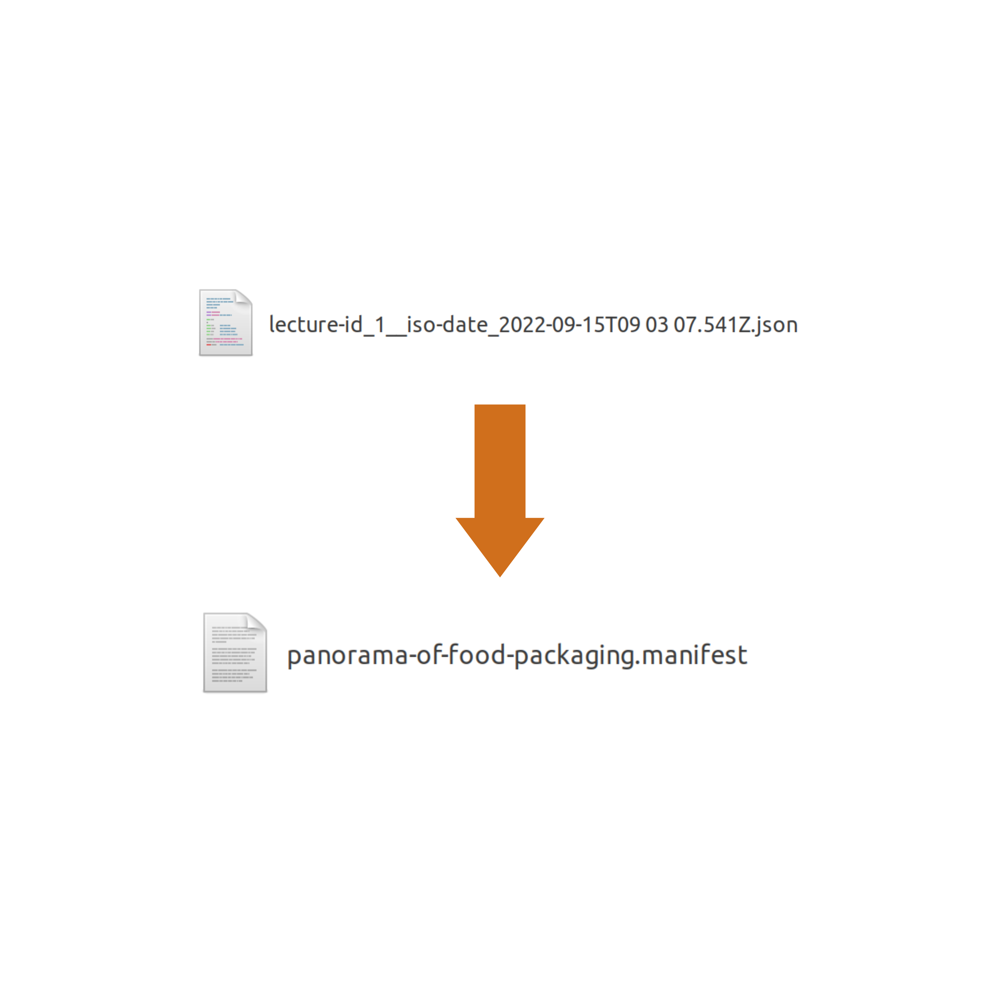

<head>
    
</head>
<header>
    
</header>

# **How to add your own lecture in the syllabus on the left (lecture already available on FitNESS 1 platform)?**

To open and see the current syllabus, double click on “sidepanel.html”.

You will then be able to select the lecture you want to display. 

**How to add your own lecture in the syllabus on the left (lecture already available on FitNESS 1 platform)?**

 For that, we will use the metadata file.

On the FitNESS platform, click on “Author’s interface to revise metadata”.

Select your name

Select a lecture 

Modify the variables you want. For example Title, Authors, Abstract, Topics, etc. Once you are satisfied with your modifications, click on “Save modifications”. By clicking on that button, you will download a file with the “json” extension.

To display your lecture in the syllabus, you will use a manifest file. A manifest is actually a metadata file. What changes is the extension. So you will change the extension from “json” to “manifest”. You can also give your file a name you will remember, for example, the name of your lecture. Here is an example where we change the file name as well as its extension. 

Once you have the new extension file, you can add your file in the “manifests” folder. In the “manifests” folder, you have the “root.manifest” file. The root file is our main file. It will help us define the lectures we want to display inside the syllabus. Open the “root.manifest” file.

Inside that file, you will see the “children” variable. Add your new file into that variable, so it will be displayed in the syllabus. Save the “root.manifest” file.

In your browser, refresh the “sidepanel.html” file. Now, you should see your new lecture in the syllabus on the left. 

If you can’t see your new lecture, here is what you can do: 

- Close the “sidepanel.html” file and open it again. 
- Force refresh the webpage, here is a guide that will help you do that : https://www.filecloud.com/blog/2015/03/tech-tip-how-to-do-hard-refresh-in-browsers/ 

# **How to add your own lecture in the syllabus on the left (lecture not available on FitNESS 1 platform)**

To add a course that does not yet exist on the platform, you will follow the same procedure as above and when you get to the [modify variables step](#modify-variables), you will change all the variable values to the values of your new course. After clicking on the "Save modifications" button, the information of your new course will be saved in a file. 

For now, you can't change all the variables yet, but in the future you will be able to do so and we will also be able to add new variables if needed.

**Contributors**

Steward OUADI, AgroParisTech

Olivier VITRAC, INRAE

File created on Wednesday, September 14, 2022. Last modified on Thursday, September 15, 2022.