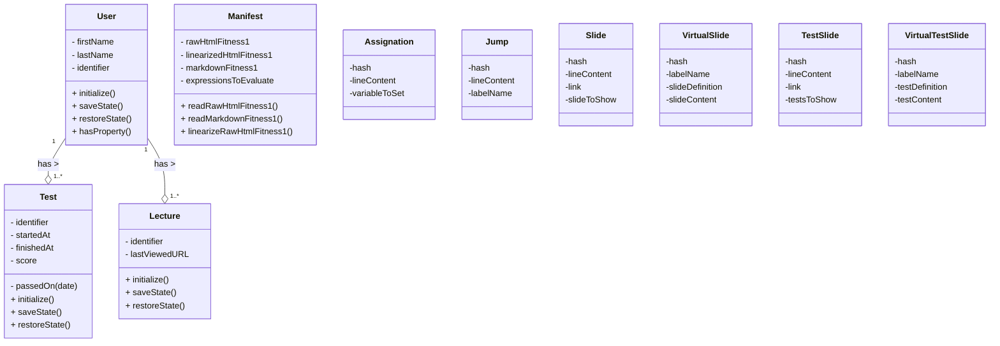

```mermaid
classDiagram
    class User{
      - firstName
      - lastName
      - identifier

      + initialize()
      + saveState()
      + restoreState()

      + hasProperty()
    }
    class Manifest{
      - rawHtmlFitness1
      - linearizedHtmlFitness1
      - markdownFitness1
      - expressionsToEvaluate

      + readRawHtmlFitness1()
      + readMarkdownFitness1()
      + linearizeRawHtmlFitness1()

    }
    class Test{
      - identifier
      - passedOn (date)
      - startedAt
      - finishedAt
      - score

      + initialize()
      + saveState()
      + restoreState()
    }
    class Lecture{
      - identifier
      - lastViewedURL

      + initialize()
      + saveState()
      + restoreState()
    }

    User "1" --o "1..*" Test : has >
    User "1" --o "1..*" Lecture : has >

class Assignation {
      -hash
      -lineContent
      -variableToSet
    }

    class Jump {
      -hash
      -lineContent
      -labelName
    }

    class Slide {
      -hash
      -lineContent
      -link
      -slideToShow
    }

    class VirtualSlide {
      -hash
      -labelName
      -slideDefinition
      -slideContent
    }

    class TestSlide {
      -hash
      -lineContent
      -link
      -testsToShow
    }

    class VirtualTestSlide {
      -hash
      -labelName
      -testDefinition
      -testContent
    }
```
